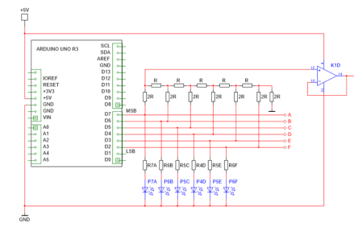

# Arduino DAC example

## idea

We create a 6 bit digital/analog converter. A very basic one.
With 6 bits we have 64 parts. 63 when we use the 0.

lsb = power supply/64
= 78.125mV

table:

| bit *1            | dec      | voltage *2 |
| :---------------- | :------: | ------:    |
| 00 0000           |   0      | 0          |
| 00 0001           |   1      | ~78.125mV  |
| 00 0010           |   2      | ~156.25mV  |
|        .          |     .    |    .       |
|        .          |     .    |    .       |
|        .          |     .    |    .       |
| 11 1111           |   63     |  ~4.92V    |

*1 output on arduino
*2 outout voltage on ops

## Schema

